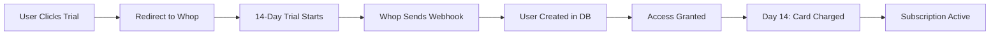

# 💰 Whop Payment Integration Status

## ✅ What's Already Done

### 1. Backend Infrastructure
- ✅ Webhook handler implemented (`/api/webhooks/whop/route.ts`)
- ✅ Database tables ready (`whop_events`, user fields)
- ✅ Signature verification for security
- ✅ User creation/update logic
- ✅ Subscription status tracking

### 2. Frontend Components
- ✅ Trial redirect endpoint (`/api/start-trial/route.ts`)
- ✅ Pricing configuration library (`/lib/pricing-config.ts`)
- ✅ Pricing display component (`/components/pricing-section.tsx`)
- ✅ Environment variable structure

### 3. Product Setup in Whop
- ✅ Product created: "Allumi - Attribution for Skool"
- ✅ Product ID: `prod_tm0tLYKsvpwxi`
- ✅ Business ID: `biz_g5ZqcyTAQA1DOK`
- ✅ Base pricing set: $59/month

## 🔧 What You Need to Do (In Whop Dashboard)

### Step 1: Create Checkout Link (5 mins)
Go to: https://whop.com/dashboard/biz_g5ZqcyTAQA1DOK/products/prod_tm0tLYKsvpwxi

1. Click "Checkout links" or "Pricing options"
2. Create new checkout link:
   - Type: **Recurring (Monthly)**
   - Price: **$59.00**
   - Advanced Options → Enable **14-day free trial**
   - Name: "Beta Launch - 14 Day Trial"
3. Copy the checkout link ID (format: `link_XXXXXXXXXXXXX`)

### Step 2: Configure Webhooks (2 mins)
Go to: https://whop.com/dashboard/biz_g5ZqcyTAQA1DOK/developer/

1. Set webhook URL: `https://allumi.com/api/webhooks/whop`
2. Select events:
   - payment_succeeded
   - membership_went_valid
   - membership_went_invalid
   - refund_created
3. Copy the webhook secret (format: `ws_XXXXXXXXXXXX`)

### Step 3: Update .env.local (1 min)
```env
WHOP_CHECKOUT_LINK=link_XXXXXXXXXXXXX  # From Step 1
WHOP_WEBHOOK_SECRET=ws_XXXXXXXXXXXX    # From Step 2
```

### Step 4: Deploy to Vercel (2 mins)
1. Add environment variables in Vercel dashboard
2. Redeploy the application

## 🎯 Pricing Strategy

### Beta Launch (First 15 Users)
- **Price**: $59/month (save $20/mo forever)
- **Trial**: 14 days free
- **Benefit**: Founder pricing locked forever
- **Urgency**: Limited spots create scarcity

### Regular Pricing (After Beta)
- **Price**: $79/month
- **Trial**: 14 days free
- **Position**: Still 80% cheaper than Hyros ($399/mo)

## 📊 How the Payment Flow Works



## 🧪 Testing Checklist

- [ ] Checkout link redirects correctly
- [ ] Test mode purchase works (card: 4242 4242 4242 4242)
- [ ] Webhook received (check Whop logs)
- [ ] User created in Supabase
- [ ] Trial period shows correctly

## 📈 Revenue Projections

| Stage | Users | MRR | Notes |
|-------|-------|-----|-------|
| Beta (Month 1) | 15 | $885 | $59/mo locked |
| Month 2 | 30 | $2,070 | Mix of beta + regular |
| Month 3 | 50 | $3,650 | Mostly $79/mo |
| Month 6 | 150 | $11,250 | Scale with affiliates |

## 🚀 Next Steps After Setup

1. **Test Everything**: Complete a full test purchase
2. **Launch to Beta**: Share with first 5 whale prospects
3. **Monitor Webhooks**: Watch for any failures
4. **Track Conversions**: Monitor trial → paid rate
5. **Iterate Pricing**: Test different price points

## 📞 Support Resources

- **Whop Dashboard**: https://whop.com/dashboard/biz_g5ZqcyTAQA1DOK/
- **Whop Docs**: https://docs.whop.com
- **Webhook Logs**: Check in Developer section
- **Test Cards**: https://docs.whop.com/payments/test-cards

## 🎉 You're Almost There!

Once you complete the 4 steps in the Whop dashboard, your payment system will be fully functional. Users will be able to:
- Start a 14-day free trial
- Get automatically charged after trial
- Access full attribution features
- Lock in founder pricing (if beta)

**Time to complete setup**: ~10 minutes
**Expected first payment**: Day 14 after first signup