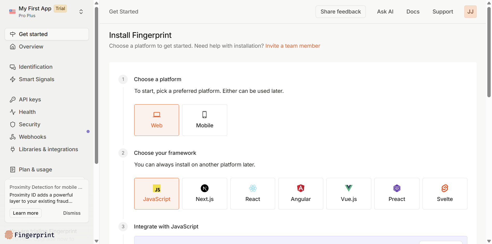

# FingerprintJS Setup Guide - Get Your Free API Key in 2 Minutes

## Quick Steps (Fastest Method - Google Sign-in)

### Step 1: Open FingerprintJS Signup
Click this link: **[https://dashboard.fingerprint.com/signup](https://dashboard.fingerprint.com/signup)**

### Step 2: Click "Continue with Google"
- Look for the **"Continue with Google"** button (it's the fastest option!)
- Click it to open Google sign-in

### Step 3: Select Your Google Account
- Choose your Google account from the list
- Complete any 2FA verification if prompted
- Click **"Continue"** on the permissions page

### Step 4: Quick Onboarding Setup
When you reach the FingerprintJS onboarding:
1. **Problem to solve**: Select **"Personalization"** (best for tracking users)
2. **Server region**: Select **"North America - Virginia"** (recommended)
3. Click **"Done"**

### Step 5: Your API Key is Ready!
You'll see the "Get Started" page with your API key already embedded in the code:

### Step 6: Find Your API Key
1. Click **"API Keys"** in the left sidebar
2. You'll see your **Public API Key** already created
3. Click the **"Copy"** button next to it

### Step 7: Paste in Allumi
1. Go back to Allumi Settings
2. Find the **"FingerprintJS API Key"** field
3. Paste your key
4. Click **Save Settings**

## That's it! 🎉

Your tracking accuracy just went from ~70% to **99.5%**!

---

## Alternative Method (Email Signup)

If you prefer not to use Google:

### Step 1: Go to Signup
Visit: **https://dashboard.fingerprint.com/signup**

### Step 2: Fill the Form
- **Email**: Your email address
- **Password**: Create a strong password
- Click **"Sign Up"**

### Step 3: Verify Email
- Check your email
- Click the verification link
- Return to the dashboard

### Step 4: Complete Setup
- **Application name**: "Allumi" or your choice
- **Region**: US-East-1 (default)
- Click **"Create Application"**

### Step 5: Copy Your API Key
- Click **"API Keys"** in the sidebar
- Copy the **Public API Key**
- Paste it in Allumi Settings

---

## What You Get with Free Plan

✅ **10,000 free API calls per month** (plenty for most creators)
✅ **99.5% accuracy** in visitor identification
✅ **No credit card required**
✅ **Instant activation**

## FAQ

**Q: Do I need to pay for FingerprintJS?**
A: No! The free plan gives you 10,000 API calls/month, which is enough for ~10,000 link clicks.

**Q: Is it safe?**
A: Yes, FingerprintJS is GDPR compliant and only creates anonymous device fingerprints.

**Q: What if I need more than 10,000 calls?**
A: Most creators never hit this limit. If you do, you're probably making enough to afford the paid plan!

**Q: Can I change the API key later?**
A: Yes, you can update it anytime in Allumi Settings.

---

## Need Help?

Email us at **support@allumi.com** or use the chat widget in your dashboard.